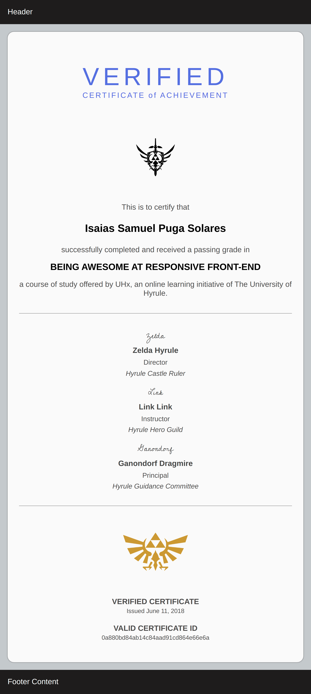
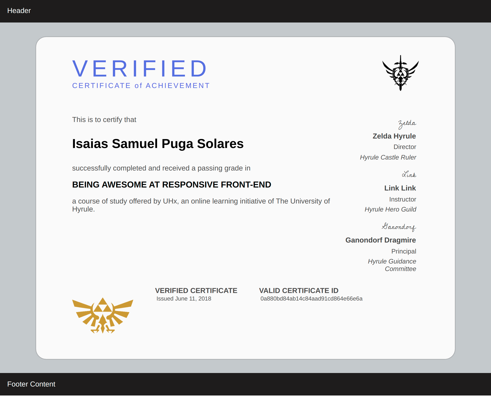

# diploma-frontend

<h2>Goal</h2>
<p>Make a frontend for diplomas/certificates.</p>
<p>Emulating Coursera responsive certificates as a learning experience. </p>
<p><i>Only using HTML & CSS</i></p>
<h3>Final result</h3>
<p float="left">
 

</p>
<h2>Goal 2<h2>
<p>Will reproduce this diplomas on Vue, Angular, and React. Hoping to understand some strengths and weaknesses</p>
<h3>Vue frontend completed</h3>
<p>Used:</p>
<ul>
<li><h4>Attribute Binding<h4> <p>The way I can interlace data/variable to HTML template to fill out the field. Using ```<b>v-bind:src</b>``` or shorthand <b>:src</b></p></li>
<li><h4>List Rendering<h4> <p>The way in which a list/set of data can be filled out with ```<b>v-for</b>``` to fill out repetitive components</p></li>
</ul>
<p>Learned about:</p>
<ul>
<li><h4>Event Handling<h4> <p>The way in which a function can be call to be executed. To modifiy data, or to change states.In case of using a button ```<b>v-on:click</b>``` or shorthand ```<b>@click</b>```</p></li>
<li><h4>Class Binding<h4> <p>The way in which CSS elements can be able/disable on the template using script data. Using ```<b>:class</b>```</p></li>
<li><h4>Computed Properties<h4> <p>Are functions on the script that can be executed to calculate & be used on the template. It will be executed before any other calculation while rendering the page. Using: ```<b>computed:{}</b>```</p></li>
<li><h4>Communication Events<h4> <p>This is useful to communicated between children components to parent components. Using on the children ```<b>this.$emit('functionName')</b>``` to emit their action, and the parent uses ```<b>@functionName="doThisFunction"</b>``` to resive de signal to execute the action: doThisFunction. </p></li>
<li><h4>Two way data-binding<h4> <p>This is useful to communicate between children and parent both ways. Using a input use ```<b>v-model="name"</b>``` on the template. And on the script of the other component data must be named ```name:null``` and specify it's type or initial value. </p></li>
</ul>
</ul>
