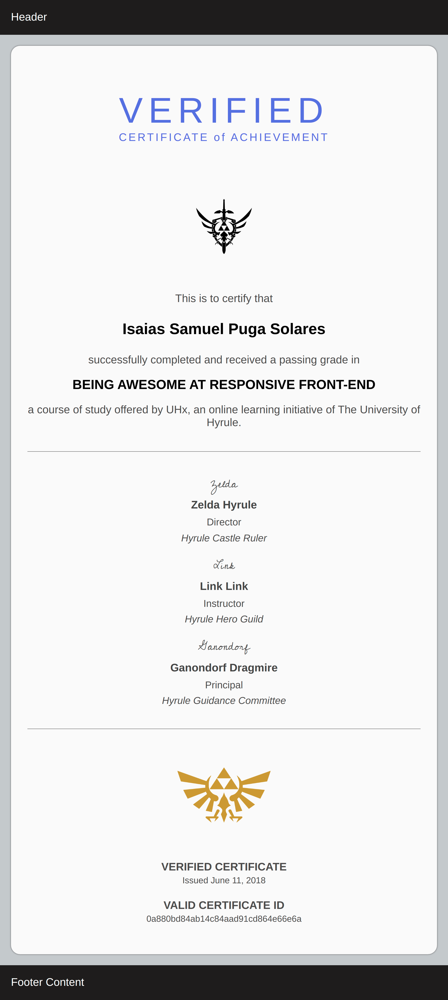

# diploma-frontend
<h2>Goal</h2>

Make a frontend for diplomas/certificates.

Emulating Coursera responsive certificates as a learning experience. 

<i>Only using HTML & CSS</i>

<h3>Final result</h3>

 

